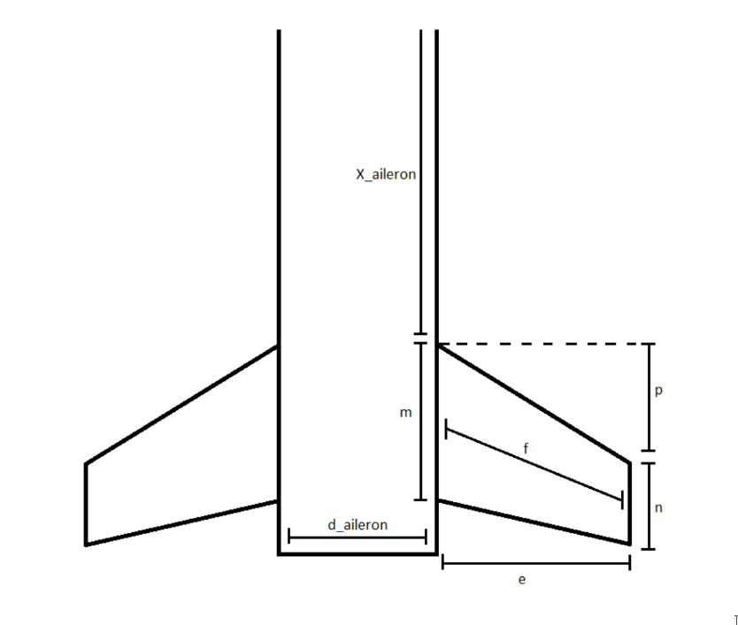
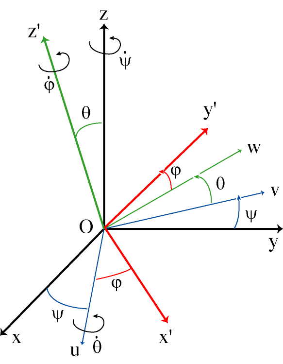

# KAOS

KAOS (Kontrol of Attitude and Orientation Simulator) is a trajectory simulation software for rocketships.

Follows the equations given in the [cnes article](https://www.planete-sciences.org/espace/IMG/pdf/vol-de-la-fusee.pdf) and in the given [documentation](README/Documentation.pdf).

## Prerequisites 

### On Windows : 

You need to install Python3 (At least Python 3.6) to your computer. Head to https://www.python.org/downloads/

You then need to install the matplotlib and numpy library used by the software to plot the relevant data and to perform some calculation. To that end, open a command prompt (press Windows + R and type CMD) and input the
following commands : 

```
pip3 install matplotlib
pip3 install numpy
```

### On Linux : 
#### Ubuntu : 

You need to install Python3 (At least Python 3.6) to your computer.
First, start by updating your package database :

```
sudo apt update
```

Then run :

```
sudo apt install python3.6
```

You then need to install the matplotlib and numpy library used by the software to plot the relevant data and to perform some calculation. To that end, open a terminal and inpu the following commands :

```
pip3 install matplotlib
pip3 install numpy
```

#### Other distributions :

If you are using other Linux distribution, chances are you already have Python 3 pre-installed as well. If not, use your distribution’s package manager. For example on Fedora, you would use dnf.

You then need to install the matplotlib and numpy library used by the software to plot the relevant data and to perform some calculation. To that end, open a terminal and input the following commands :

```
pip3 install matplotlib
pip3 install numpy
```

## How to use it ?

Clone the project.

Run `main.py`.

Our exemple works with SERA3 based on data provided by PERSEUS.

## To run your simulation

### 1 - Create your rocket

To create a rocket, you first need to head to ./rockets and make a copy of rocket_template. Give it the name of your rocket

Here is what the template currently looks like : 

```
rocket_name = Rocket(
        aux_masse = 0.0,
        moteur = Moteur(),

        parachutes = [Parachute()],
        corps = [Corps()],
        aileron =[Aileron()],
        ogive = Ogive(),
        jupe_retreints_list = [Jupe_retreint()],

        rcs = [RCS()],

        cn = None,
        cg = None,
        cpa = None,
        accelerometres_list=[Accelerometre()],
        gyroscopes_list = [Gyroscope()],
        barometres_list = [Barometre()],
        magnetometres_list = [Magnetometre()],
        thermometres_list = [Thermometre()],
        GPS_list = [GPS()],
        list_Cx = np.array(
        [
        [0.1, 0.49458948],
        [0.7, 0.62356508],
        [0.8, 0.68864667],
        [0.85, 0.61258763],
        [0.9, 0.63427252],
        [0.95, 0.68763119],
        [1, 0.82986492],
        [1.05, 0.86513013],
        [1.1, 0.89168829],
        [1.2, 0.88589495],
        [2, 0.57830435],
        ]
        ),
)

```

Let's break it down.

#### A - Auxiliary masses :

It includes all masses not in a standard part and must me a float number.

#### B - Moteur : 

The engine is one of the main component of your rocket. Here is how to implement it :

```
moteur = Moteur(engine_reader(path to thrust profile (use ./rockets/engines/your_profile), masse)
```
#### C - Parachutes : 

Parachutes are used to slow down your rocket. You can implement a number of parachutes in your rocket.
Here is how to implement it :

```
parachutes_list = [Parachute(surface area, masse, deployement_altitude = altitude, Deploy at apoapsis ? = True/False),...]
```

#### D - Corps :

The body of your rocket is the main structural part of the ship. There can be several bodies each separated by a Jupe_retreint() element.  Here is how to implement it:

```
corps_list = [Corps(Body height,Body diameter, Mass without ergol, Ergol mass, Distance to the top of the rocket, inertie = None),...]

```
The distance to the top of the rocket is the distance between the top of the body and the top of the head.

#### E - Ailerons :

Ailerons are the main aerodynamic part of your rocket. Here is how to implement them:

```
aileron_list = [Aileron(e,n,p,m,diameter of the body,Distance to the top of the rocket, masse,
                            amount of ailerons on the body, inertie = None),...]
```

To visualize all these arguments, use the following schematic : 



#### F - Ogive :

Here is how to implement the head of your rocket : 

```
ogive = Ogive(Head height,Head diameter, masse, Head geometry, Inertia = None) 
```

Your head geometry can be on of the following :

* parabolique
* ogivale
* elliptique
* conique

#### G - Change of diameter in the body :

You may implement a change of diameter in the body of your rocket. Here is how :

```
jupe_retreints_list = [Jupe_retreint(height, Position of the change of start of diameter change  (from the top),
                       d1, d2, mass), ...]
```

#### H - RCS : 

RCS are little gaz exhaust on the side of the rocket to control its attitude. Here is how to implement them : 

```
rcs_list = [RCS(axis of thrust (angle in radian), height, thrust, masse), ...]
```

Ideally you should place them symetrically according to the axis of revolution of the rocket's body.


#### I - Custom Cn_Alpha :

You may implement a custom Cn_Aplha or let the program calculate it with the rocket's geometry.

Do do that, chose a value or leave none to let it calculate the Cn_Alpha

```
cn = value # None by default

```

#### J - Custom X_CG :

You may implement a custom X_CG or let the program calculate it with the rocket's geometry.

Do do that, chose a value or leave none to let it calculate the X_CG

```
cg = value # None by default

```

#### K - Custom X_CPA :

You may implement a custom X_CPA or let the program calculate it with the rocket's geometry.

Do do that, chose a value or leave none to let it calculate the X_CPA

```
cpa = value # None by default

```


#### L - Sensors : 

You may simulate the behaviour of the rocket's sensors by providing their error model.

##### Accelerometer
```
accelerometres_list = [Accelerometre(Position of the sensor [x,y,z], phi = 0.0, theta=0.0, psi=0.0,
                                            incertitude_phi=0.0, incertitude_theta=0.0, incertitude_psi=0.0,
                                            noise_power=0.0, erreur_de_justesse=0.0), ...]
```
phi, theta and psi are the angular shift between the sensors and the rocket. You can provide the incertitude in each direction, the amplitude of the noise, and the measurement bias.

##### Gyroscope
```
gyroscopes_list = [Gyroscope(sequence, phi = 0.0, theta=0.0, psi=0.0,
                                            incertitude_phi=0.0, incertitude_theta=0.0, incertitude_psi=0.0,
                                            noise_power=0.0, erreur_de_justesse=0.0), ...]
```
You can leave sequence as is. This variable will be set in main.py.

##### Barometer
```
gyrometres_list = [Gyrometre(noise_power=0.0, erreur_de_justesse=0.0), ...]
```

##### Barometer
```
barometres_list = [Barometre(noise_power=0.0, erreur_de_justesse=0.0), ...]
```

##### Magnetometer
```
magnetometres_list = [Magnetometre(noise_power=0.0, erreur_de_justesse=0.0), ...]
```

##### Thermometer
```
thermometres_list = [Thermometre(noise_power=0.0, erreur_de_justesse=0.0, ...]
```

##### GPS
```
GPS_list = [GPS(noise_power=0.0, erreur_de_justesse=0.0), ...]
```


#### M - Import the corresponding aerodynamic coefficients :

You can paste your array. The format is an array of tuple, number of Mach and the Cx.
There are some default values that you may change.

```
list_Cx = np.array(
        [
        [0.1, 0.49458948],
        [0.7, 0.62356508],
        [0.8, 0.68864667],
        [0.85, 0.61258763],
        [0.9, 0.63427252],
        [0.95, 0.68763119],
        [1, 0.82986492],
        [1.05, 0.86513013],
        [1.1, 0.89168829],
        [1.2, 0.88589495],
        [2, 0.57830435],
        ]
        ),

```


### 2 - Choose your wind environnement :

Provided that you have a wind profil coming from a weather baloon in the standard format (see [vent_ballon1.txt](wind/vent_ballon1.txt in the wind/ directory), you can use the wind_parser.sh script to convert it to an usable wind profile by the software.

#### On Windows :

Launch a powershell session in the software directory and run the following command :

```
./wind_parser.sh weather_baloon_data profile_name
```
#### On Linux :

Launch a terminal session in the software directory and run the following command :

```
./wind_parser.sh weather_baloon_data profile_name
```

You can then choose your profile_name in the wind_arg variable located in `main.py`.

```py
wind_arg = ActiveWind('dir_wind_profile2')
```


### 3 - Choose the launch site :

You can change the size and orientation of the launch pad as well as the position of the launch site (coming).

```py

longeur_rampe = 8                   # taille de la rampe de lancement
angle_rampe = 80 / 90 * np.pi / 2   # angle de la rampe avec le sol en radian 
beta = departure_wind_heading()     # départ face au vent
```

### 4 - Choose some few more parameters :

```py

h = 0.05                # pas d'intégration pour la méthode Runge kutta 4

nb_iter_max = 50000     # initialise le nombre d'iteration max
```

### 5 - Choose the display :

6 options are possible (cumulative). Uncomment the one you want. `affichage_parametre` and `affichage_arrow_dynamic` are by default.

`affichage_parametre`: displays 2 parameters one according to the other (the available parameters are time `t`, positions x, y, z with `list_x`, `list_y`, `list_z`, speed norm with `list_v`, gimbal angles with `list_phi`, `list_theta`, `list_psi`. Any other parameter has to be implemented by yourself)

`affichage_angle_quaternion`: displays the gimbal angles according to the altitude as well as a component of the wind, it allows to study the stability

`vent`: displays the wind column for the given altitude

`affichage_quiver`: displays the trajectory in 3d as a vector

`affichage_arrow_dynamic`: displays the trajectory in dynamic 3d

`affichage_fusée` : displays the form of your rocket


### 6 - Create results tables:

You can generate csv files with data relevant to the flight and to the sensors by uncommenting respectively the `results_table` line and/or the `result_sensors` line.
The files will be created (or updated if they already exist) in the `resultats` folder

The parameters of `results_table` are as follow : 

```py
results_table (t, Y, periode_ech, wind_arg, X_CG, gps, sequence, temps=None, x=None, y=None, z=None,
            vitesses=None, norme_vitesse=None, accelerations=None, accelerations_mesurées=None,
            angles_euler=None, angles_cardan=None, quaternions=None, vitesses_angulaires=None,
            accelerations_angulaires=None, pression=None, temperature=None, magnetique=None, GPS=None)
```
Change any of the `None` value by anything else if you want it to appear as a row on the csv file.

For example, if you only want to have the data of the trajectory in the table, you can write :
```py
results_table (t, Y, periode_ech, wind_arg, X_CG, gps, sequence, temps=1, x=1, y=1, z=1)
```

You will have to set the following parameters :

`periode_ech` is the time delta between each value of the table
`sequence` is the order of the rotations you have to make to stay consistent with the phi, theta, psi system you chose.
You can look at the following schematic to have an example




In this case, sequence would be `"zxy"`


### Run  :

Run `main.py`.


## Communication with the on-board computer.

The simulator can create a communication with the on-board computer, in which the simulator gives the sensors data, and the on-board computer gives the actuators data, provided by its control algorithm.
To do so, you may set the `control` variable to `True`  in the `main.py` file :
```py
control = True #True si oui et False si non
```
To start this communication, you have to open a server socket on the computer running the simulation. It is done automatically when running the `main.py` file. 
Wait until the simulator display `Waitting`. Then you have to set the port number as displaid by the simulator in your client socket. Then run the client on the on-board computer.
To build your client, some example are available in the files `socket_client_py.py` and `socket_client_C.c`. You may also use the functions created in `traitement_message.py` and `traitement_message.py` to help your with the transmission protocole.
